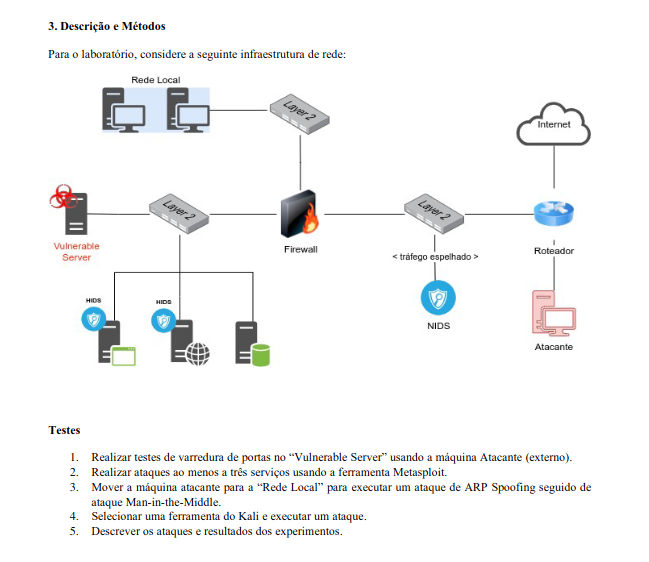

# Prática de Ataques em um ambiente Virtualizado - Disciplina de Mestrado em Ciência da 

Esse é um projeto para a realização de ataques em um ambiente virtualizado, o objetivo é explorar vulnerabilidades de um nó vulnerável de uma rede interna usando ferramentas disponíveis na distribuição Kali Linux e Metasploit. A Figura 1 ilustra o cenário de rede no qual foram realizados os ataques.

  
  
Figura 1 - Cenário proposto

 

