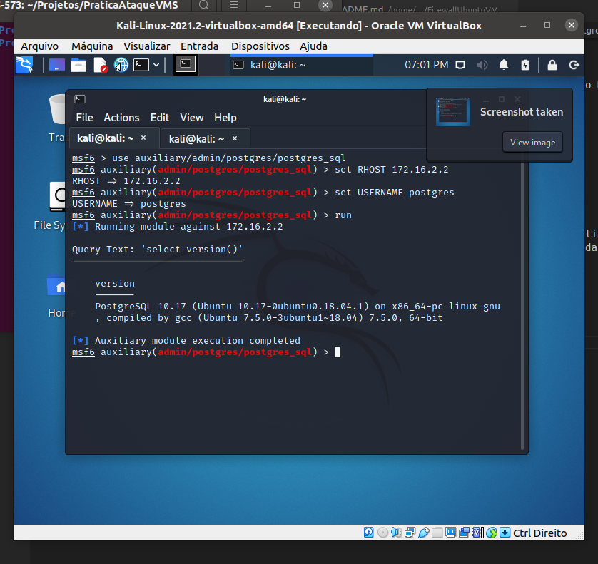

# Prática de Ataques em um ambiente Virtualizado - Disciplina de Mestrado em Ciência da Computação

Esse é um projeto para a realização de ataques em um ambiente virtualizado, o objetivo é explorar vulnerabilidades de um nó vulnerável de uma rede interna usando ferramentas disponíveis na distribuição Kali Linux e Metasploit. A Figura 1 ilustra o cenário de rede no qual foram realizados os ataques.

<p>
  
  <p align="center">Figura 1 - Cenário proposto</p>
</p>
<br>

# Configuração do cenário
O nó atacante do experimento utilia uma imagem do Kali Linux 2020, todos os demais usam a imagem do sistema operacional Ubuntu 18.04 (server), esses possuem um servidor http, ftp e telnet.

Na instalação base de todos os nós Ubuntu, foram executados os seguintes comandos:
```bash
sudo apt install apache2
sudo apt install openssh-server
sudo apt install lynx
sudo apt install ftp
sudo apt install iptables
sudo apt install bind9
sudo apt install proftpd
sudo apt install telnetd
```

Para o experimento foi criada uma Rede NAT, no software virtualbox isso é realizado em Arquivo->Preferências->Rede e criar Rede NAT.

Nas máquinas da rede local (host1a e host1b), o nome associada a placa de rede é intnet1, nas máquinas da DMZ (host2a, host2b) o nome será intnet2, na placa de rede interna da WAN (host3a) estará conectada a uma Rede NAT, por fim, na VM do Firewall tem-se a primeira placa de rede interna na intnet1, a segunda na intnet2 e a terceira com a mesma Rede NAT do host3a. A tabela 1 apresenta as redes internas das VM's. 

| VM        | Redes Internas | 
| ------------- |:-------------:| 
| host1a (LAN)        | intnet1 |
| host1b (LAN)     | intnet1     |  
| host2a (DMZ) | intnet2      |
| host2b (vulnerable) | intnet2      |
| host3a (WAN) | Rede NAT |
| Firewall | intnet1, intnet2, Rede NAT |    
| Atacante | Rede NAT | 

 <p align="center">Tabela 1 - Placas de rede </p>

 A seguir são apresentadas as configurações de rede de todos os nós do experimeto.
 ## Arquivo /etc/netplan/00-installer-config.yaml do host1a
```bash
network:
  ethernets:
    enp0s9:
      dhcp4: no
      addresses: [172.16.1.1/24]
      gateway4: 172.16.1.254
      nameservers:
        addresses: [8.8.8.8]  
  version: 2
```
## Arquivo /etc/netplan/00-installer-config.yaml do host1b
```bash
  network:
    ethernets:
      enp0s9:
        dhcp4: no
        addresses: [172.16.1.2/24]
        gateway4: 172.16.1.254
        nameservers:
          addresses: [8.8.8.8]
    version: 2
```
## Arquivo /etc/netplan/00-installer-config.yaml do host2a
```bash
network:
  ethernets:
    enp0s9:
      dhcp4: no
      addresses: [172.16.2.3/24]
      gateway4: 172.16.2.254
      nameservers:
        addresses: [8.8.8.8]
  version: 2
```

## Arquivo /etc/netplan/00-installer-config.yaml do host2b(vulneravel)
```bash
network:
  ethernets:
    enp0s9:
      dhcp4: no
      addresses: [172.16.2.2/24]
      gateway4: 172.16.2.254
      nameservers:
        addresses: [8.8.8.8]
  version: 2
```

## Arquivo /etc/netplan/00-installer-config.yaml do host3a
```bash
network:
  ethernets:
    enp0s3:
      dhcp4: true    
  version: 2
```
## Arquivo /etc/netplan/00-installer-config.yaml do Firewall
```bash
network:
  ethernets:
    enp0s8:// WAN/INTERNET
      dhcp4: true
    enp0s9: //LAN
      dhcp4: no
      addresses: [172.16.1.254/24]
    enp0s10://DMZ
      dhcp4: no
      addresses: [172.16.2.254/24]
    version: 2
```

Pelo fato do atacante usar DHCP, nenhuma configuração adicional foi realizada.


## Ligando roteamento  no firewall
Agora ligaremos ligaremos o modo de roteamento para o firewall, nessa configuração o Firewall é quem possui uma interface com acesso à Internet, e ele que de fato irá ceder aos nós da LAN e DMZ. Para isso, no firewall e no host3a abra o arquivo /etc/sysctl.conf, e acrescente a linha abaixo:
```bash
net.ipv4.ip_forward=1
```

# Configuração do Firewall
Nessa pratica o objetivo é atacar uma rede vulnerável, por esse motivo o Firewall terá políticas brandas de segurança, ele só pode ser acessado pelo host da lan 172.16.1.1

```bash
echo "limpando as tabelas iptables"
iptables -t nat -F
iptables -F

echo "ligando mascaramento para tudo que sair para internet"
iptables -t nat -A POSTROUTING -o enp0s8 -j MASQUERADE

echo "Permitindo acesso ssh pelo host1a"
iptables -A INPUT -p tcp --dport 22 -i enp0s9 -s 172.16.1.1 -j ACCEPT
iptables -A INPUT -j DROP

echo "Permitindo a passagem de trafego encaminhado pelo firewall"
iptables -A FORWARD -j ACCEPT

echo "Permitindo a passagem de trafego que sai do Firewall pelo firewall"
iptables -A OUTPUT -j ACCEPT
```

# Configurações específicas do nó atacante
```
kali@kali:~$ sudo ip route add 172.16.1.0/24 via 10.0.2.5
kali@kali:~$ sudo ip route add 172.16.2.0/24 via 10.0.2.5
```

# Configurações específicas do nó vulnerável (host2b)
Para tornarmos esse nó realmente vulnerável, iremos tomar algumas ações específicas que seguem.

## Senha óbvia para o usuário root

 começamos alterando a senha de root do sistema, através de:
```
root@nakao:~# passwd root
Enter new UNIX password: root
Retype new UNIX password: root
passwd: password updated successfully
```

## Acesso SSH externo para root
Além disso, permitiremos o acesso externo via ssh para o usuário root, para tal iremos alterar o arquivo /etc/ssh/sshd_config, acrescentando a seguinte linha:
```
PermitRootLogin yes
```

## Configuração de um banco de dados vulnerável
Primeiramente, vamos realizar o download do banco de dados POSTGRESQL
```
sudo apt-get install postgresql postgresql-contrib
```

Agora, vamos mudar a senha do usuario padrao do banco da dados
```
sudo su postgres
psql postgres postgres
postgres=# \password postgres
Enter new password: 123456 
Enter it again: 123456
```

Finalmente, vamos criar uma base de dados e popular com algumas informações sensitivas.
```
CREATE DATABASE sistemavendas;
GRANT ALL PRIVILEGES ON DATABASE sistemavendas TO postgres;
\c sistemavendas;
CREATE TABLE CLIENTE(cpf varchar(50),email varchar(100), endereco varchar(500), cardNumber varchar(100), nome varchar(100), PRIMARY KEY(cpf));
INSERT INTO CLIENTE VALUES('08765590087', 'joao@gmail.com','rua das oliveiras 838','42123-23123','joao');
INSERT INTO CLIENTE VALUES('08765320087', 'pedro@gmail.com','rua das palmeiras 838','42123-1123','pedro');
INSERT INTO CLIENTE VALUES('08225590087', 'maria@gmail.com','rua das cascatas 238','42123-231222','maria');
INSERT INTO CLIENTE VALUES('08225592227', 'mariana@gmail.com','rua das bananas 892','33322-231222','mariana');
```

Agora, vamos  tornar a base acessível de forma externa, para isso acrescentamos ao final arquivo /etc/postgresql/10/main/pg_hba.conf
```
host    all             all              0.0.0.0/0                       trust
host    all             all              ::/0                            trust
```
Por fim, bastou alterar a variável listen_addresses no arquivo /etc/postgresql/10/main/postgresql.conf para:
```
listen_addresses = '*'
```

# Atividade 1 - Varredura de portas:
A primeira atividade proposta foi a varredura de portas, para tal foi usado o comando NMAP no atacante, a Figura 2 ilustra esse procedimento, no qual podemos observar as portas 21, 22, 23, 53, 80 e 5432 abertas.
<p>
  
  <p align="center">Figura 2 - Varredura de portas</p>
</p>
<br>

# Atividade 2 - Realizar ataques a 3 serviços usando a ferramenta Metasploit

## auxioliary/scanner/ssh/ssh_login
Para usar esse exploit, basta definir qual o alvo e o arquivo de tentativas de autenticação, a Figura 3 ilustra esse processo para as variáveis RHOSTS (endereço do alvo) e USERPASS_FILE(arquivo de tentativas de autenticação). Ao final da execução, a sessão foi capturada.
<p>
  
  <p align="center">Figura 3 - Sessão ssh obtida com sucesso</p>
</p>
<br>

##  auxiliary/admin/postgres/postgres_sql
Para usar esse exploit, basta definir qual o alvo e o login do banco, adicionalmente pode-se definir uma tentativa de senha, a Figura 4 ilustra esse processo para as variáveis RHOSTS (endereço do alvo) e USERNAME(arquivo de tentativas de autenticação). As Figuras 5, 6 e 7 ilustram o procedimento a seguir para obter acesso a informações de uma tabela do banco de dados, partindo da listagem de bases, tabelas e queria select.
<p>
  
  <p align="center">Figura 4 - Conexão bem sucedida com o postgres</p>
</p>
<br>
<p>
  
  <p align="center">Figura 5 - Obtendo nomes das bases dados</p>
</p>
<br>
<p>
  
  <p align="center">Figura 6 - Obtendo tabelas das bases dados</p>
</p>
<br>
<p>
  
  <p align="center">Figura 7 - Obtendo informações sensitivas</p>
</p>
<br>


